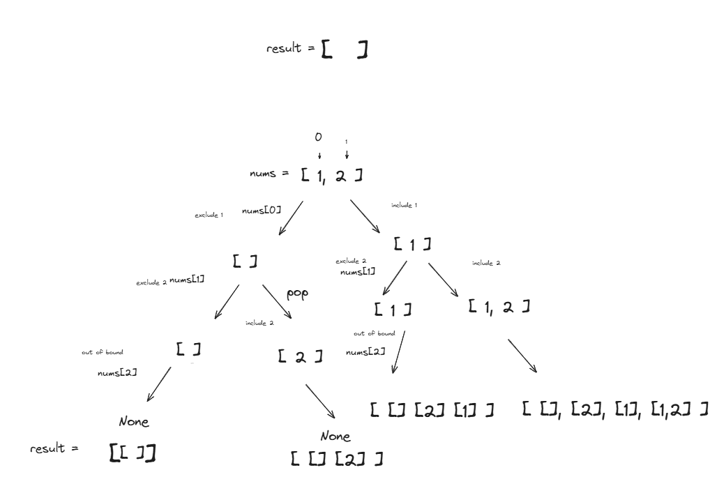

### Array Subset Backtracking problem (Recursion)
Breaking down `array_subset` backtracking code step by step and understand how the recursion and the call stack work together.

**Understanding the Problem**

The goal is to find all possible subsets (including the empty set) of a given array `nums`. For example, if `nums = [1, 2]`, the subsets are `[]`, `[1]`, `[2]`, and `[1, 2]`.

**Understanding Backtracking**

Backtracking is a general algorithmic technique used to solve problems by trying to build a solution incrementally, one piece at a time. At each step, we explore different options. If an option leads to a dead end or an invalid solution, we "backtrack" (undo the last choice) and try a different option.

In this subset problem, at each element `nums[idx]`, we have two choices:
1.  **Exclude** `nums[idx]` from the current subset.
2.  **Include** `nums[idx]` in the current subset.

We recursively explore both possibilities for each element.

**Analyzing the Code**

```python
def array_subset(nums: list):
    result = [] # Stores all generated subsets
    
    # Helper recursive function
    def backtracker(idx: int, subset: list):
        # Base Case: We have considered all elements
        if idx == len(nums):
            # Add the current subset (a copy!) to the result
            result.append(subset[:]) 
            return # Stop this recursive path
            
        # --- Recursive Step (Two Choices) ---

        # Choice 1: Exclude nums[idx]
        # We move to the next element without adding the current one
        backtracker(idx + 1, subset) 
        
        # Choice 2: Include nums[idx]
        # 1. Add the current element to the subset
        subset.append(nums[idx])
        # 2. Move to the next element WITH the current one added
        backtracker(idx + 1, subset)
        # 3. ***BACKTRACKING STEP*** Remove the element we just added
        # This is crucial to explore other possibilities correctly
        subset.pop() 

    # Initial call: Start from index 0 with an empty subset
    backtracker(0, []) 
    
    return result # Return the list of all subsets
```

**Explanation of Key Parts:**

1.  **`result = []`**: This list lives in the outer function's scope and is used to collect all the complete subsets found by the `backtracker`.
2.  **`backtracker(idx, subset)`**: This is the core recursive function.
    * `idx`: The index of the element in `nums` that we are currently considering whether to include or exclude.
    * `subset`: The list representing the subset being built *up to the decisions made for elements before `idx`*. This list is passed *by reference*, which is why the `pop()` operation is so important.
3.  **Base Case (`if idx == len(nums):`)**: When `idx` reaches the length of `nums`, it means we have made a decision (include or exclude) for *every* element from index 0 up to `len(nums) - 1`. The `subset` list at this point represents a valid, complete subset. We add a *copy* (`subset[:]`) of this `subset` to `result` and return, stopping this particular branch of recursion. We use `subset[:]` to append a copy because the `subset` list will be modified later by `pop()` operations as the recursion unwinds.
4.  **Exclude Choice (`backtracker(idx + 1, subset)`)**: This call explores the possibility of *not* including the element `nums[idx]`. We simply move to consider the next element (`idx + 1`) without changing the current `subset`.
5.  **Include Choice (`subset.append(nums[idx])`, `backtracker(idx + 1, subset)`, `subset.pop()`)**: This block explores the possibility of *including* the element `nums[idx]`.
    * `subset.append(nums[idx])`: We add the element `nums[idx]` to the current `subset`.
    * `backtracker(idx + 1, subset)`: We recursively call `backtracker` for the next element (`idx + 1`). Now, the `subset` contains `nums[idx]`. All recursive calls stemming from this point will see `nums[idx]` in their `subset` until it's removed.
    * `subset.pop()`: **This is the backtracking step.** After the recursive call for the "include" choice returns (meaning all subsets containing `nums[idx]` starting from this branch have been found), we *remove* `nums[idx]` from the `subset`. This is crucial because we need the `subset` to be in the correct state for the *parent* call to explore its *other* possibilities (although in this specific code structure, the parent already explored its "exclude" branch first). More generally, `pop()` ensures that when the function returns, the `subset` list is the same as it was *before* the current function call modified it by appending.

**Tracing with an Example: `nums = [1, 2]`**

Let's trace the execution and how the stack frame changes. A stack frame holds the local variables for a function call (`idx`, `subset` reference).

1.  **`array_subset([1, 2])` is called.** `result = []`.
2.  **`backtracker(0, [])` is called.** (Stack: `[idx=0, subset=[]]`)
    * `idx` (0) is not `len(nums)` (2).
    * **Choice 1 (Exclude 1):** Call `backtracker(1, [])`.
        * **`backtracker(1, [])` is called.** (Stack: `[idx=0, subset=[]]`, `[idx=1, subset=[]]`)
            * `idx` (1) is not `len(nums)` (2).
            * **Choice 1 (Exclude 2):** Call `backtracker(2, [])`.
                * **`backtracker(2, [])` is called.** (Stack: ..., `[idx=1, subset=[]]`, `[idx=2, subset=[]]`)
                    * `idx` (2) is `len(nums)` (2). Base Case!
                    * `result.append(subset[:])` -> `result.append([]`. `result` is now `[[]]`.
                    * `return`. Pop `[idx=2, subset=[]]` from stack. (Stack: ..., `[idx=1, subset=[]]`)
            * Back in `backtracker(1, [])`. The "exclude 2" branch finished.
            * **Choice 2 (Include 2):**
                * `subset.append(nums[1])` -> `subset.append(2)`. `subset` (which is the *same* list object as in the `idx=1` frame) becomes `[2]`.
                * Call `backtracker(2, [2])`.
                    * **`backtracker(2, [2])` is called.** (Stack: ..., `[idx=1, subset=[2]]`, `[idx=2, subset=[2]]`)
                        * `idx` (2) is `len(nums)` (2). Base Case!
                        * `result.append(subset[:])` -> `result.append([2])`. `result` is now `[[], [2]]`.
                        * `return`. Pop `[idx=2, subset=[2]]` from stack. (Stack: ..., `[idx=1, subset=[2]]`)
                * Back in `backtracker(1, [2])`. The "include 2" recursive call finished.
                * **Backtrack:** `subset.pop()`. `subset` (the same list object) becomes `[]`.
            * Return from `backtracker(1, [])`. Pop `[idx=1, subset=[]]` from stack. (Stack: `[idx=0, subset=[]]`)
        * Back in `backtracker(0, [])`. The "exclude 1" branch finished.
    * **Choice 2 (Include 1):**
        * `subset.append(nums[0])` -> `subset.append(1)`. `subset` (the *same* list object as in the `idx=0` frame) becomes `[1]`.
        * Call `backtracker(1, [1])`.
            * **`backtracker(1, [1])` is called.** (Stack: `[idx=0, subset=[1]]`, `[idx=1, subset=[1]]`)
                * `idx` (1) is not `len(nums)` (2).
                * **Choice 1 (Exclude 2):** Call `backtracker(2, [1])`.
                    * **`backtracker(2, [1])` is called.** (Stack: ..., `[idx=1, subset=[1]]`, `[idx=2, subset=[1]]`)
                        * `idx` (2) is `len(nums)` (2). Base Case!
                        * `result.append(subset[:])` -> `result.append([1])`. `result` is now `[[], [2], [1]]`.
                        * `return`. Pop `[idx=2, subset=[1]]` from stack. (Stack: ..., `[idx=1, subset=[1]]`)
                * Back in `backtracker(1, [1])`. The "exclude 2" branch finished.
                * **Choice 2 (Include 2):**
                    * `subset.append(nums[1])` -> `subset.append(2)`. `subset` becomes `[1, 2]`.
                    * Call `backtracker(2, [1, 2])`.
                        * **`backtracker(2, [1, 2])` is called.** (Stack: ..., `[idx=1, subset=[1, 2]]`, `[idx=2, subset=[1, 2]]`)
                            * `idx` (2) is `len(nums)` (2). Base Case!
                            * `result.append(subset[:])` -> `result.append([1, 2])`. `result` is now `[[], [2], [1], [1, 2]]`.
                            * `return`. Pop `[idx=2, subset=[1, 2]]` from stack. (Stack: ..., `[idx=1, subset=[1, 2]]`)
                    * Back in `backtracker(1, [1, 2])`. The "include 2" recursive call finished.
                    * **Backtrack:** `subset.pop()`. `subset` becomes `[1]`.
                * Return from `backtracker(1, [1])`. Pop `[idx=1, subset=[1]]` from stack. (Stack: `[idx=0, subset=[1]]`)
            * Back in `backtracker(0, [1])`. The "include 1" recursive call finished.
        * **Backtrack:** `subset.pop()`. `subset` becomes `[]`.
    * Return from `backtracker(0, [])`. Pop `[idx=0, subset=[]]` from stack. (Stack: Empty)

3.  **Initial `backtracker` call finishes.**
4.  **`array_subset` returns `result`.** `result` is `[[], [2], [1], [1, 2]]`. The order might vary slightly depending on the exact trace, but all subsets will be present.

**Summary of Stack Behavior:**

* Each recursive call `backtracker(idx, subset)` pushes a new frame onto the call stack. This frame remembers the values of `idx` and the reference to the `subset` list for that specific call's context.
* The stack grows as we make recursive calls (`backtracker(idx + 1, ...)`). The maximum depth of the stack is the length of the input array (`len(nums)`).
* When a base case is hit (`idx == len(nums)`) or when both the "exclude" and "include" branches stemming from a call have finished executing, the current stack frame is popped.
* The `pop()` operation on the `subset` list happens *before* a frame is popped (specifically, after the "include" recursive call returns). This modifies the list object *referenced by the parent frame*, ensuring that the `subset` is correctly restored to its state before the current level's "include" decision was made.

This step-by-step process, where at each element you make a choice and recursively solve the rest of the problem, and then undo your choice (`pop()`) to explore other possibilities, is the essence of backtracking for problems like generating subsets or permutations. The stack implicitly manages the state of the problem (which choices have been made) as you explore the decision tree.


